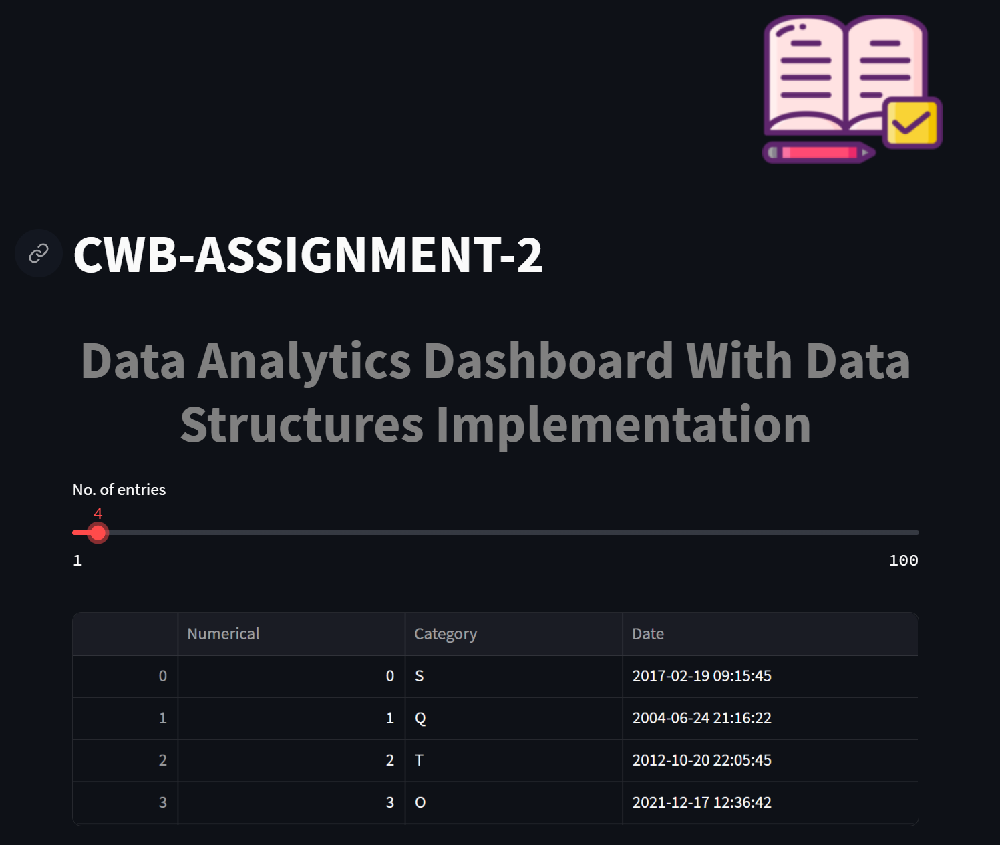

# CWB_A2
<h1 align="center">Data Analytics Dashboard With Data Structures Implementation</h1>
<h2>A Dataframe which stores random data consisting of 
  <ul>
  <li>Id</li>
  <li>Category</li>  
  <li>Date📅</li></ul></h2>

<h2>Use of various data structures
<ol>
  <li>Linked List</li>
  <li>Stack</li>
  <li>Queue</li>
</ol>
</h2>

# FLOW➡️
<h2>⭐User can select the no. of entries from the slider</h2>

<h2>⭐Then random data will be added up and a dataframe will be created</h2>

<h2>⭐The same data will be converted in different data structures like LL,Stack and Queue
<ul>
  <li><h3>Then we can write the data in the form of various data structures</h3></li>

  <li><h3>We can even visualize the different data structures using expander</h3></li>

</ul>
</h2>
 
<h1 align="center">IMP Point to note is that alll the functions which we were  used were modular functions i.e  made in different files!</h1>

# HOW TO TEST ON YOUR LAPTOP
<ol>
  <li>Clone the repository using- git clone </li>
  <li>Install streamlit and other libraries like numpy panda- pip install streamlit/numpy/pandas</li>
  <li>Then open new terminal and write- streamlit run main.py</li>
</ol>
